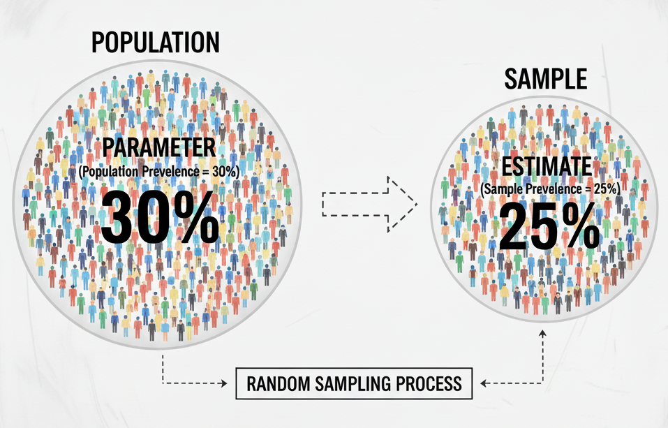
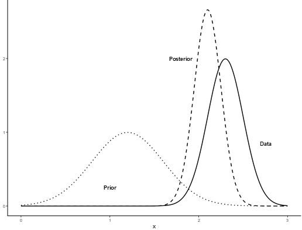

```{r setup, include=FALSE}

## I encourage the users to install the required R-packages before proceeding with analysis

#install.packages (c("readxl","xlsx","tidyverse","DescTools","binom","gtsummary","gt","metafor","meta","brms","bayesmeta","rstan","rstantools","bayestestR","posterior","bayesplot","ggdist","ggridges","glue","webshot2","tiff","knitr"))

library(openxlsx)
library (readxl)
library (gtsummary)
library(tidyverse)
library(dplyr)
library(gt)
library (xlsx)
library(DescTools)
library(tiff)
library(webshot2)
library(psych)
library(rjags)
library(tibble)
library(knitr) 
library(rstan)
library(here)
library(bayesmeta)
library(brms)
library(bayestestR)
library(shinystan)

opts_chunk$set(echo = TRUE)

```

Before talking about Bayesian binomial model, let's review some important concepts.

# Binomial distribution

The **binomial distribution** is a probability distribution that summarizes the likelihood that a value will take one of two independent states across a given number of trials. The binomial distribution is frequently used to model the number of successes in a sample of size drawn **with replacement (that is important)** from a population.

In simpler terms, it's used when you have an experiment that:

1.  Is repeated a fixed number of times.

2.  Has only **two possible outcomes** on each trial (Sick vs. Healthy).

3.  Has the **same probability of success** on each trial.

4.  Has **independent trials** (the outcome of one trial doesn't affect the others)

Let me explain with a simple example. We want to estimate the **prevalence** (the proportion of a **population** ,let's say among people living in Montréal, Canada in the year 2025, that has a specific disease or condition *at a given point in time*) of Disease X in a population. The true prevalence of the disease in population (also known as "**parameter**") is unknown. It is impractical that we test all people from the target population (in this case, all people living in Montréal in the year 2025) . What we can do, is to take a **sampl**e from the **population**.

{width="317"}

Let's assume,

We have randomly selected 1000 individuals and test them. In this scenario, the process perfectly fits a binomial distribution because:

1.  **Binary Outcome:** Each test has only two results: the person **has the disease** (Sick) or **does not have it** (Healthy).

2.  **Fixed Trials:** The number of tests, `n`, is fixed at 1000.

3.  **Independent Trials:** One person's disease status does not affect another's (assuming no outbreak cluster).

4.  **Constant Probability:** Each person has the same underlying probability, `p`, of having the disease (this probability is the prevalence we're trying to estimate).

When we find that 30 people have the disease, we have observed `y = 30` Sick event. The entire set of possible outcomes (from 0 to 100 people having the disease) and their associated probabilities form a binomial distribution.

For more about binomial distribution: <https://www.itl.nist.gov/div898/handbook/eda/section3/eda366i.htm>

------------------------------------------------------------------------

So, **what is the prevalence estimate for above example?**

**Answer**:

```{r}
## So, we have - 
y <- 30 # Number of people with disease
n <- 1000 # Number of people tested

## Prevalence of X disease in Montréal
Prevalence <- y/n
Prevalence
## If we want to express in percentage 
paste0("Prevalence of X disease: ",Prevalence*100,"%")
```

So, we can say that the prevalence of X disease in the population of Montréal is 3%.

Unfortunately, this is not a good interpretation. Because, a single proportion estimate does not account for **uncertainty** — such as random sampling variation, test accuracy, or selection bias. In practice, we want to quantify this uncertainty by constructing a **confidence interval (CI)** around our estimate. This uncertainty reflects how confident we are that the **true prevalence** in the population lies within a certain range.

There are several ways of calculating Ci, such as - Wald apprximation, Wilson method, Clopper-Pearson method, etc

Let's calculate CI for our prevalence estimate,

```{r}

binom.test(y, n, conf.level = 0.95)

```

Now, we can say that **"The prevalence of X disease in the population of Montréal is 3% (95% CI: 2% – 4%)"**.

***What does this mean?***

This result means the following:

> *If we were to repeat this same study many times — each time randomly selecting 1000 individuals and calculating a 95% confidence interval — then approximately 95% of those intervals would contain the true population prevalence, while 5% would not.*

In other words, the **method** we used to construct the interval has a long-run success rate of 95% in capturing the true value.\
However, for our **single study**, we cannot say with certainty whether the true prevalence lies inside or outside this particular interval — we only know that the procedure has a 95% chance of producing a correct interval over many repetitions.

😔

That’s not quite what we usually *want* to know, isn't it?

In practice, we often wish to make a direct probability statement about the true prevalence, such as:

> “*We are 95% confident that the true prevalence lies between 2% and 4%.*”

Unfortunately, this statement is **not** technically correct for our previous analysis.

Why?. Because the true prevalence is **fixed** — it’s not something that changes from one study to another. The uncertainty lies in our sample, *NOT* in the **parameter** itself.

Of note, the analysis we performed so far represents the **frequentist approach** to estimating prevalence for binomial data.\

There is another powerful framework called the **Bayesian approach**, which allows us to directly express uncertainty about the parameter itself — for example, by saying that ***the probability of the prevalence being between 2% and 4% is 95%***.\

This interpretation aligns much better with how researchers naturally think about uncertainty.

------------------------------------------------------------------------

# How Bayesian statistics work?

Bayesian statistics provide a way to update our beliefs about an unknown parameter (such as disease prevalence) based on observed data.

It starts with a **prior distribution**, which represents what we believe about the parameter before seeing the data (for example, previous studies might suggest the prevalence is around 5%).

------------------------------------------------------------------------

***From where we can get prior information?** - From previous study, reasonable guess from expert, or we can just say that "we don't know".*

***Does the prior influence the final results? -** Yes, when the data is weak. No, otherwise*

------------------------------------------------------------------------

Then, we collect **new data** (e.g., 30 positive cases out of 1000 tests), and use **Bayes’ theorem** to combine this prior information with the data’s likelihood.

The result is a **posterior distribution** — a new, updated belief about the parameter after considering the data.

Mathematically:

$$
\text{Posterior} \propto \text{Likelihood} \times \text{Prior}
$$

{width="274"}

From the posterior, we can calculate a **credible interval**, which gives the range of values within which the true parameter lies with a given probability . Unlike frequentist confidence intervals, **Bayesian credible intervals** directly express uncertainty about the parameter itself. So, in Bayesian we assume "**true prevalence**" is **not a fixed value (\*\*\*\*\*That is very important\*\*\*\*)**. It has own distribution.

For a bit more about Bayesian dtatistics visit: <https://jalal2025.quarto.pub/my-web/Bayesian_statistics_course.html>

# Bayesian binomial model

The **Bayesian binomial model** is a statistical approach used to estimate the **proportion or prevalence of a binary outcome**, such as the presence or absence of a disease. It combines **observed data** with **prior knowledge** through Bayes’ theorem to generate a **posterior distribution** for the parameter of interest.

In the context of disease prevalence:

-   Let `y` be the number of cases observed in a sample of size `n`.
-   Assume `y ~ Binomial(n, p)`, where `p` is the true prevalence.
-   A **prior distribution** is assigned to `p` to reflect previous knowledge or uncertainty (commonly Beta or uniform).
-   The posterior distribution of `p` integrates the prior and the observed data, providing a **probabilistic estimate** of prevalence with credible intervals.

**Advantages of the Bayesian approach** include:

-   Ability to incorporate prior knowledge or expert opinion.
-   Provides **full probability distributions** instead of single-point estimates.
-   Flexibility to handle **small sample sizes** or complex hierarchical structures.

**Applications:** Estimating disease prevalence, infection rates, or any scenario with binary outcomes in epidemiology, clinical trials, or public health research.

Let's calculate again the prevalence of X disease.

First, we will assume that we not know what is the true prevalence of X disease in the population of Montréal. But, as are talking about proportion, so, it will be between 0 and 100. So,

-   **Prior**: "*We don't know, but it can be 0 to 100 with equal probability*". `Beta(1,1)` is the approximate representation of our prior information. People usually say such information as "non-informative or vague prior". Notably, non-informative prior in one scale can be very informative prior in another scale.

```{r}

## Prior: Uniform prior (Beta(1,1))
alpha_prior <- 1
beta_prior <- 1


## Data
positive_cases <- 30
total_tests <- 1000


## Posterior parameters (Beta distribution)
alpha_posterior <- alpha_prior + positive_cases
beta_posterior <- beta_prior + total_tests - positive_cases

## Calculate posterior mean (point estimate of prevalence)
posterior_mean <- round((alpha_posterior / (alpha_posterior + beta_posterior))*100,3)

## Calculate posterior median
posterior_median <- round((qbeta(0.5, alpha_posterior, beta_posterior))*100,3)


## Calculate posterior mode
posterior_mode <- round(((alpha_posterior - 1) / (alpha_posterior + beta_posterior - 2))*100,3)

## Calculate 95% credible interval
credible_interval <- round((qbeta(c(0.025, 0.975), alpha_posterior, beta_posterior))*100,3)

## Results table
results <- data.frame(
  Statistic = c("Mean", "Median", "Mode", "95% CrI (lower)", "95% CrI (upper)"),
  Value = c(posterior_mean, posterior_median, posterior_mode, credible_interval[1], credible_interval[2])
)

results
```

We can plot the posterior distribution:

```{r}

# Use unscaled (proportion) values for plotting
posterior_mean_prop   <- posterior_mean / 100
posterior_median_prop <- posterior_median / 100
posterior_mode_prop   <- posterior_mode / 100
credible_interval_prop <- credible_interval / 100

# Plot posterior distribution
curve(dbeta(x, alpha_posterior, beta_posterior), 
      from = 0.02, to = 0.045, 
      main = "Posterior Distribution of Prevalence\nwith Central Tendency Measures",
      xlab = "Prevalence (proportion)", ylab = "Density",
      col = "blue", lwd = 2)

# Add vertical lines
abline(v = posterior_mean_prop, col = "red", lty = 1, lwd = 2)
abline(v = posterior_median_prop, col = "darkgreen", lty = 2, lwd = 2)
abline(v = posterior_mode_prop, col = "purple", lty = 3, lwd = 2)

# Add credible interval
abline(v = credible_interval_prop, col = "gray", lty = 3)

# Legend
legend("topright", 
       legend = c("Posterior", "Mean", "Median", "Mode", "95% CrI"),
       col = c("blue", "red", "darkgreen", "purple", "gray"),
       lty = c(1, 1, 2, 3, 3), lwd = 2)

```

Now, this analysis solve our fundamental problem. We can say that

> *Based on the Bayesian binomial model with a uniform prior, the estimated prevalence of X disease in Montréal is **3.09% (95% CrI: 2.11%–4.25%)**, meaning there is a 95% probability that the true prevalence lies within this range.*

However, one can now want to know that -

> “*What is the probability that the true prevalence of X disease is **3% or less**?”*

Unfortunately, we can might not get the answer of such question form our previous analyses. Fortunately, there is way to answer this question by doing Monte Carlo simulation.

```{r}

## MONTE CARLO APPROACH (rbeta sampling)
set.seed(123)  # for reproducible results
n_sim <- 10000
posterior_samples <- rbeta(n_sim, 
                           alpha_posterior, 
                           beta_posterior)

# post_mode <- density(posterior_samples)$x[which.max(density(posterior_samples)$y)]

## Results table
results <- data.frame(
  Statistic = c("Mean", 
                "Median",  
                "95% CrI (lower)", 
                "95% CrI (upper)"),
  Value = c(mean(posterior_samples)*100, 
            median(posterior_samples)*100,
            quantile(posterior_samples, c(0.025))*100,
            quantile(posterior_samples, c(0.975))*100
                    ))

results
```

Plot the results

```{r}
# Monte Carlo histogram
hist(posterior_samples, breaks = 50, prob = TRUE,
     main = NULL,
     xlab = "Prevalence", ylab = "Density",
     xlim = c(0.02, 0.045), col = "lightblue")
lines(density(posterior_samples), col = "red", lwd = 2)
legend("topright", legend = c("Sample density", "Histogram"), 
       col = c("red", "lightblue"), lwd = 2, fill = c(NA, "lightblue"))
```

**Figure**: Posterior distribution of prevalence.

Now, we can calculate “*What is the probability that the true prevalence of X disease is **3% or less**?”*

```{r}
## Probability that prevalence <= 3%
prob_leq_3 <- mean(posterior_samples <= 0.03)*100
prob_leq_3
```

We can interpret this as:

> "*Based on the observed data and our uniform prior, there is approximately 45% probability that the true prevalence is 3% or less."*

**So far, we have learnt how Bayesian binomial model. And we have calculated prevalence of disease X in one population. But in real world we may require to calculate the prevalence of same disease (or multiple disease) in different population.**

Let's see, how we can do such analysis!!

For this purpose,

-   We will calculate prevalence of a disease, called "neurocysticercosis", in different population using a real world data set.

-   We present the results in a nice table.

# Applying Bayesian binomial model with real data

## Description of data set

We have recently completed a brief systematic review of research articles reporting the frequency of neurocysticercosis (NCC, a parasitic disease of human central nervous system caused by the larval stage of zoonotic tapeworm, *Taenia solium*) among people with headache (PWH). In that review, we identified 10 studies which met the inclusion criteria (data on NCC among PWH, and NCC diagnosis was based on brain imaging). The **data set** is given in the "***Data***" folder. The data is in MS Excel (sheet = PWH). There are only five variables in this the data set:

-   **id:** Unique ID for each study

-   **first_author:** First author

-   **study_setting:** Study setting ("Clinic_or_hospital" OR "Community")

-   **n:** Number of people with headache manifestation who underwent brain imaging.

-   **y:** Number of NCC-cases

First, import data (users are advised to keep all file within a folder, otherwise may require to set working directory manually using `setwd()` function)

tdat

```{r}

library(here)
tdat <- read_excel(here("Data", "NCC_among_PWH.xlsx"))                  

## Working data set
df <- tdat
```

Let's check what are the data we have,

```{r}

glimpse(df)
head(df)
summary(df)

```

We see the inputs for variable "study_setting" are a bit weird. Let's first check what are the inputs

```{r}
unique(df$study_setting)
```

We see there are two types of inputs, \`

```         
"Clinic_or_hospital""Community" 
```

We will make `Clinic_or_hospital` a bit readable

```{r}
df <- df %>% 
  mutate(study_setting = case_when(
    study_setting == "Clinic_or_hospital" ~ "Health center",
    TRUE ~ study_setting
  ))
```

Now, we want to calculate the proportion of NCC among PWH for each row of the data set and express as percentage and associated 95% credible intervals. To complete the task, we will follow a bit advanced method:

1.  We will write a model. This is a `Stan` model. Then, we will compile the mode (it may require few minutes to complete).

2.  We will prepare our data in such way that is compatible with the model.

3.  Then, we will apply this model for each row of our data.

4.  We will check the convergence of the models, and results.

## Model

The model assumes that the number of NCC cases $y_i$ in study $i$ follows a binomial distribution with study-specific sample size $n_i$ and probability parameter $p_i$:

$$
\begin{aligned}
y_i &\sim \text{Binomial}(n_i, p_i) \\
p_i &\sim \text{Beta}(1, 1)
\end{aligned}
$$

A uniform $\text{Beta}(1, 1)$ prior was specified for $p_i$, representing an uninformative prior distribution that is equivalent to a uniform distribution over the interval $(0, 1)$.

```{r eval=FALSE}

model_code <- "
data{
int<lower=0> N_studies;
int<lower=0> n[N_studies];
int<lower=0> y[N_studies];
int<lower=0> alpha_prior;
int<lower=0> beta_prior;
}

parameters {
vector <lower=0, upper=1> [N_studies]p;
}

model{
p ~ beta(alpha_prior,beta_prior);

for (i in 1:N_studies){
y[i] ~ binomial(n[i],p[i]);
}
}
        

generated quantities{
vector[N_studies] y_rep;
for (i in 1:N_studies){
y_rep[i] = binomial_rng (n[i],p[i]);
}
}
"
compiled_model <- stan_model(model_code = model_code)

```

## Data preparation

```{r}
df <- df %>% 
  mutate(st_id = paste0("St_",id))

df1 <- df %>% 
  select(st_id,n,y)
  

model_data <- list(
  N_studies = nrow(df),
  n = df$n,
  y = df$y,
  alpha_prior = 1,
  beta_prior =1
)


```

## Fit the model

```{r eval=FALSE}

## Fit the model
fit <- sampling(
  compiled_model,
  data = model_data,
  iter = 10000,
  warmup = 5000,
  chains = 4,
  seed = 123
)

```

It is better to save the results as `.rds` file. In that case, we will not need to run the model, again we can just, check the "**Results**"

```{r eval=FALSE}
library(here)
saveRDS(fit, file = here("Outputs", "Bayesian_model_results.rds"))
```

## Results

### Model convergence checking

First, reload the model and print the results

```{r}

library(here)
x <- readRDS(here("Outputs","Bayesian_model_results.rds"))

print(x, pars = "p", probs = c(0.025,0.50,0.975) )
```

Now, check the convergence

------------------------------------------------------------------------

***How to check model convergence (and if it fits the data well)?***

**Source**: <https://ourcodingclub.github.io/tutorials/brms/>

1.  `Bulk_ESS` and `Tail_ESS` \> 1000
2.  `Rhat` = 1
3.  Trace plot
4.  Density plot (distribution of mean)
5.  Posterior predictive check plot

------------------------------------------------------------------------

We can easily check (1) and (2) from previous chunk of code. For different plots there is an amazing function `launch_shinystan()` from R-package **{shinystan}.**

```{r eval=FALSE}

launch_shinystan(x)

```

So far, we have calculated the prevalence proportion for multiple studies using Bayesian binomial model.

Now, we want to present the results in a nice table.

### Creating a table for publication

```{r}


# Extract posterior samples
posterior_samples <- extract(x)

# Get summary statistics for theta parameters
theta_samples <- posterior_samples$p
colnames(theta_samples) <- df1$st_id

# Calculate posterior summaries
posterior_summaries <- data.frame(
  st_id = df1$st_id,
  y = df1$y,
  n = df1$n,
  Posterior_Mean = apply(theta_samples, 2, mean),
  Posterior_Median = apply(theta_samples, 2, median),
  CI_2.5 = apply(theta_samples, 2, quantile, probs = 0.025),
  CI_97.5 = apply(theta_samples, 2, quantile, probs = 0.975),
  SD = apply(theta_samples, 2, sd)
)


df2 <- df %>% 
  left_join(posterior_summaries, by = "st_id") %>% 
  mutate(Prop = paste0(
    sprintf("%.1f",Posterior_Median*100)," (", 
    sprintf("%.1f",CI_2.5*100)," - ", 
    sprintf("%.1f",CI_97.5*100),")")) %>% 
  select(id,first_author,study_setting,Prop)


# More robust table code:
table <- df2 %>%
  arrange(id) %>% 
  gt() %>% 
  cols_label(
    id = "Study ID",
    first_author = "Reference", 
    study_setting = "Setting",
    Prop = "Bayesian estimate\n%(95% CrI)"
  ) %>%
  fmt_number(
    columns = c(id),
    decimals = 0
  ) %>%
  tab_style(style = list(cell_fill(color = "lightgray")),
            locations = cells_body(rows = seq(1, nrow(df2), 2))) %>% 
  tab_options(
    table.font.size = px(12),
    heading.align = "center",
    table.font.names = "Times New Roman"
  )

table
```

Make the table a bit pretty

```{r}
# Create a prettier table
table <- df2 %>%
  arrange(id) %>% 
  gt() %>% 
  # Column labels with better formatting
  cols_label(
    id = md("**Study ID**"),
    first_author = md("**Reference**"),
    study_setting = md("**Study Setting**"),
    Prop = md("**Bayesian Estimate**<br>**% (95% CrI)**")
  ) %>%
  # Header styling
  tab_header(
    title = md("**Neurocysticercosis Prevalence Among People with Headaches**"),
    subtitle = "Bayesian Beta-Binomial Model Estimates by Study"
  ) %>%
  # Column alignment
  cols_align(
    align = "center",
    columns = c(study_setting, Prop)
  ) %>%
  cols_align(
    align = "left", 
    columns = c(first_author)
  ) %>%
  # Zebra striping with subtle colors
  tab_style(
    style = list(
      cell_fill(color = "#f8f9fa"),
      cell_text(weight = "normal")
    ),
    locations = cells_body(rows = seq(1, nrow(df2), 2))
  ) %>%
  # Header style
  tab_style(
    style = list(
      cell_fill(color = "#2c3e50"),
      cell_text(color = "white", weight = "bold", size = px(14))
    ),
    locations = cells_column_labels()
  ) %>%
  # Title styling
  tab_style(
    style = list(
      cell_text(weight = "bold", size = px(16), color = "#2c3e50")
    ),
    locations = cells_title(groups = "title")
  ) %>%
  # Border styling
  tab_style(
    style = cell_borders(
      sides = c("bottom", "top"),
      color = "#dee2e6",
      weight = px(1)
    ),
    locations = cells_body()
  ) %>%
  # Table options
  tab_options(
    table.font.names = "Times New Roman",
    table.font.size = px(12),
    heading.align = "center",
    column_labels.border.top.color = "white",
    column_labels.border.bottom.color = "#2c3e50",
    column_labels.border.bottom.width = px(2),
    table_body.border.bottom.color = "white",
    data_row.padding = px(6)
  )

table_html <- table %>% as_raw_html()
table
```
